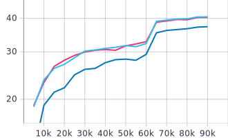
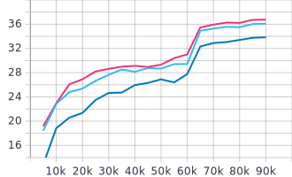

# Path Aggregation Network in Detectron2

Shu Liu, Lu Qi, Haifang Qin, Jianping Shi, Jiaya Jia.

[[`arXiv`](https://arxiv.org/pdf/1803.01534)] [[`BibTeX`](#CitingPANet)]

The PANet was an architecture that won 1st place in COCO 2017 Instance Segmentation challenge and 2nd place in the COCO 2017 Detection challenge. It did so by introducing the following modifications to Mask RCNN (with FPN backbone):

1. An additional **bottom up branch** (PAFPN) for better localization info via shortening the path to low level features.
2. **Adaptive feature pooling** (ADPP) for aggregating features across all levels for each proposal. More information = Better performance.
3. **Fusion of features** (FCF) from fully connected and convolutional layers.

<p align="center">

</p>

**Note**: In the original author's implementation, they have used Group Normalisation in the RoI heads as well. However, this fails in the current implementation (Pytorch 1.4) probably because of Group Norm not accepting empty batches. This has been recently fixed via a recent [pull request](https://github.com/pytorch/pytorch/pull/32401). So you could use to pytorch's nightly build and presumably use Group Norm in the roi heads to get a more accurate implementation.

## Ablation Study

Dark Blue: PAFPN </br>
Light Blue: PAFPN + ADPP </br>
Pink: PAFPN + ADPP + FCF </br>

BBox AP           |  Mask AP
:-------------------------:|:-------------------------:
  |  

## Comparison

| Model     | Backbone | lr sched | AP box | AP mask |
|-----------|----------|----------|--------|---------|
| Mask RCNN | R50      | 1x       | 38.6   | 35.2    |
| PANet     | R50      | 1x       | 40.3   | 36.8    |

## Usage
### Training
1. Single GPU
```bash
python projects/PANet/tools/train_net.py \
        --config-file projects/PANet/configs/coco/panet_R_50_FPN_1x.yaml SOLVER.IMS_PER_BATCH 2 SOLVER.BASE_LR 0.0025
```

2. Multi GPU
```bash
python projects/PANet/tools/train_net.py --num-gpus 8 \
        --config-file projects/PANet/configs/coco/panet_R_50_FPN_1x.yaml
```
3. Resume Training
```bash
python projects/PANet/tools/train_net.py \
        --resume \
        --config-file projects/PANet/configs/coco/panet_R_50_FPN_1x.yaml SOLVER.IMS_PER_BATCH 2 SOLVER.BASE_LR 0.0025
```

### Evaluation
```bash
python projects/PANet/tools/train_net.py \
        --eval-only MODEL.WEIGHTS projects/PANet/output/model_final.pth \
        --config-file projects/PANet/configs/coco/panet_R_50_FPN_1x.yaml SOLVER.IMS_PER_BATCH 2 SOLVER.BASE_LR 0.0025
```

### Inference
1. Batch inference
```bash
python demo/demo_batch.py \
        --config-file configs/coco/panet_R_50_FPN_1x.yaml \
        --weights output/model_final.pth \
        --input_dir demo/test_images \
        --output demo/test_results
```
2. Standard demo (single image)
```bash
python demo/demo.py \
        --config-file configs/coco/panet_R_50_FPN_1x.yaml \
        --input demo/test_images/input.jpg \
        --output demo/test_results \
        --opts MODEL.WEIGHTS output/model_final.pth
```

### Export Caffe2 Model (WIP)

## <a name="CitingPANet"></a>Citing PANet

If you use PANet, please use the following BibTeX entry.

```
@inproceedings{liu2018path,
      author = {Shu Liu and
                Lu Qi and
                Haifang Qin and
                Jianping Shi and
                Jiaya Jia},
      title = {Path Aggregation Network for Instance Segmentation},
      booktitle = {Proceedings of IEEE Conference on Computer Vision and Pattern Recognition (CVPR)},
      year = {2018}
    }
```
